# Architecture Diagrams

This document contains visual diagrams of the Nurve system architecture.

## System Overview

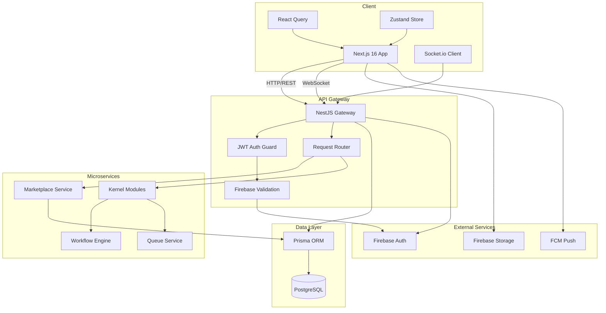

## Authentication Flow

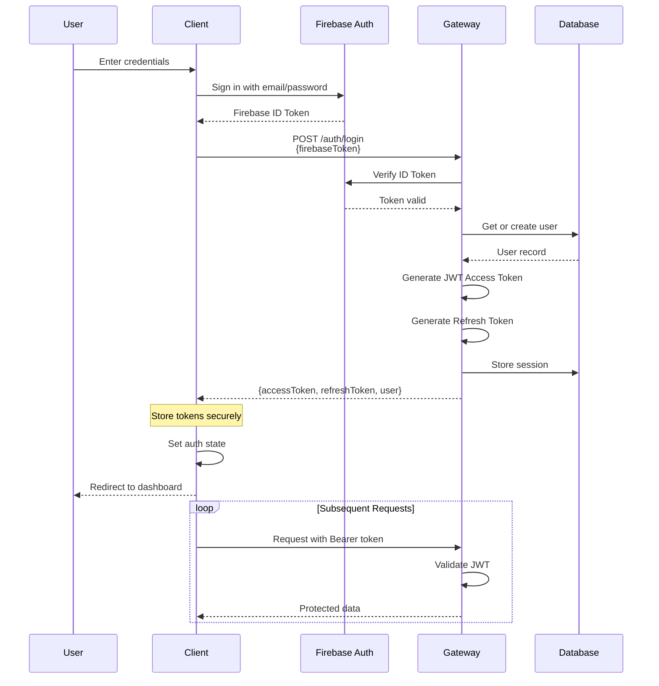

## Module Architecture (Kernel System)

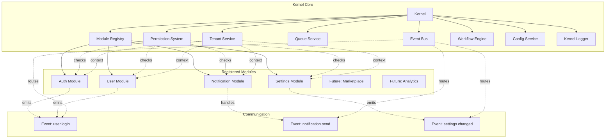

## Request Lifecycle

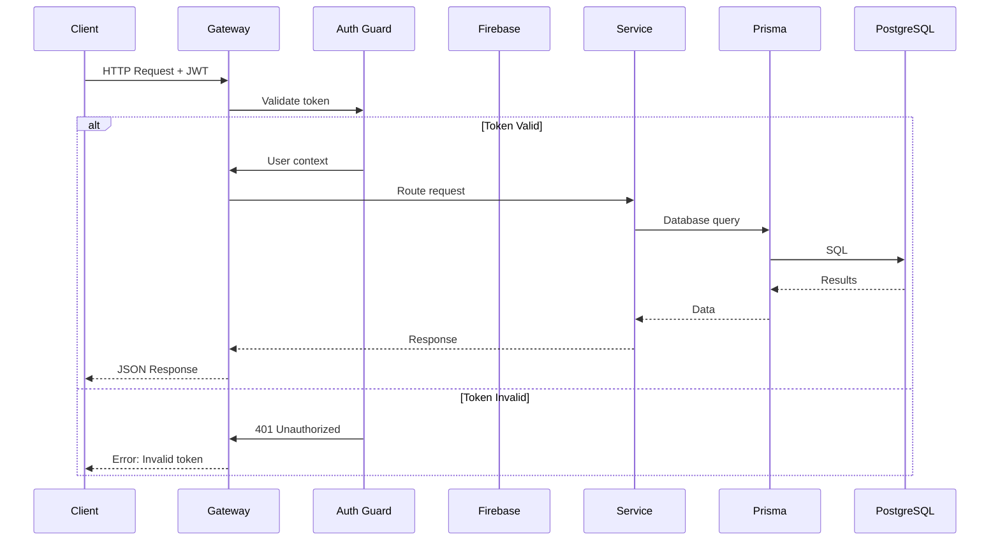

## Queue Processing Flow

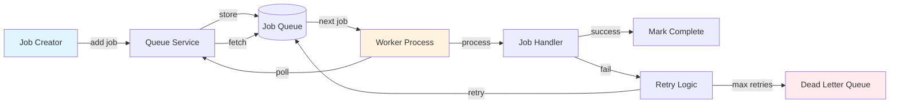

## Database Schema Overview

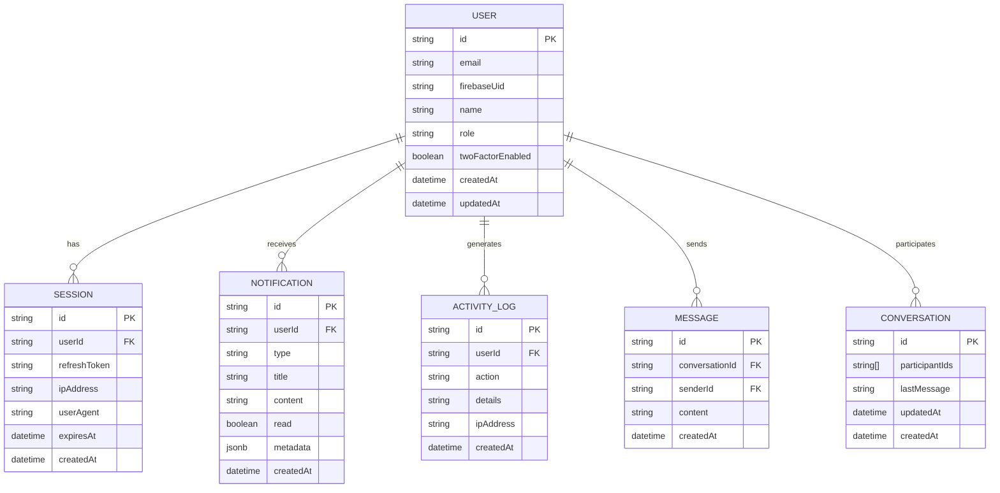

## Real-time Communication

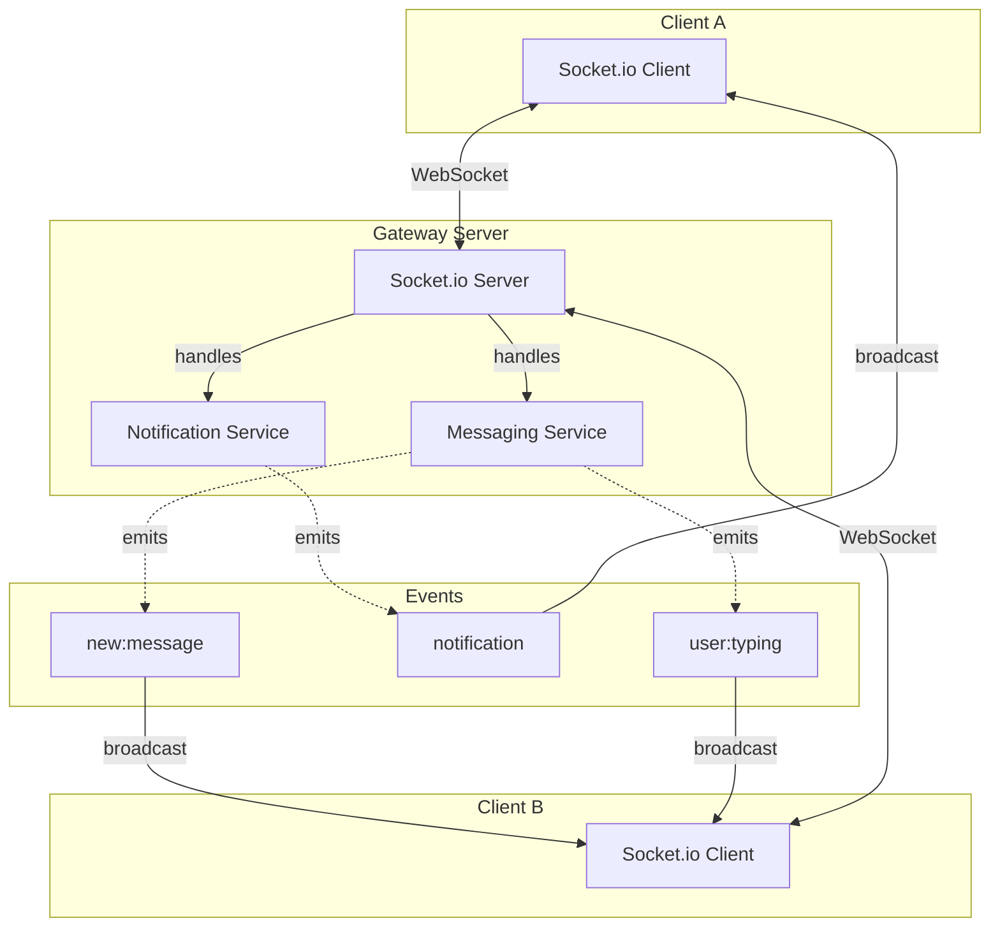

## Scraper Architecture (Planned)

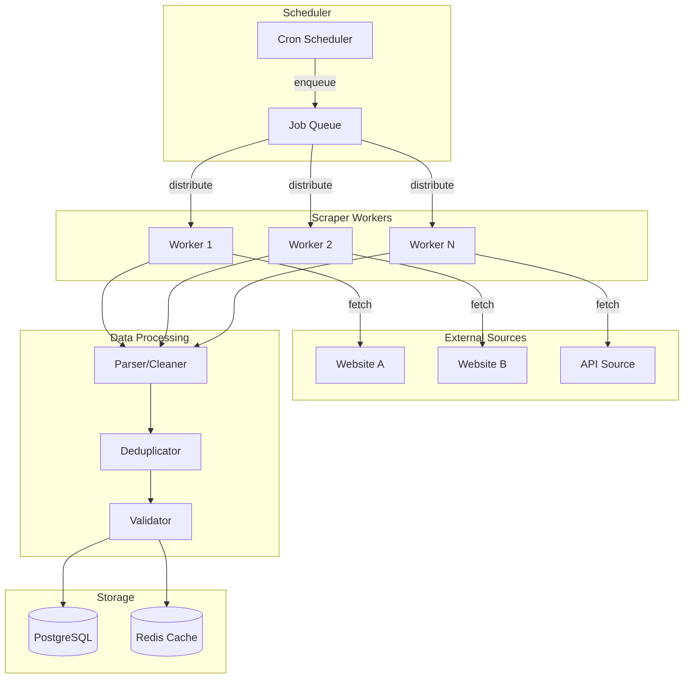

## Multi-tenancy Architecture (Future)

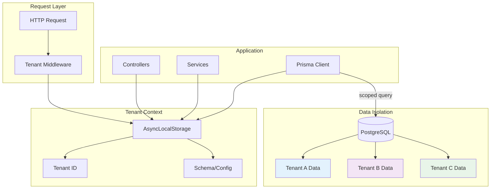

## Workflow Engine

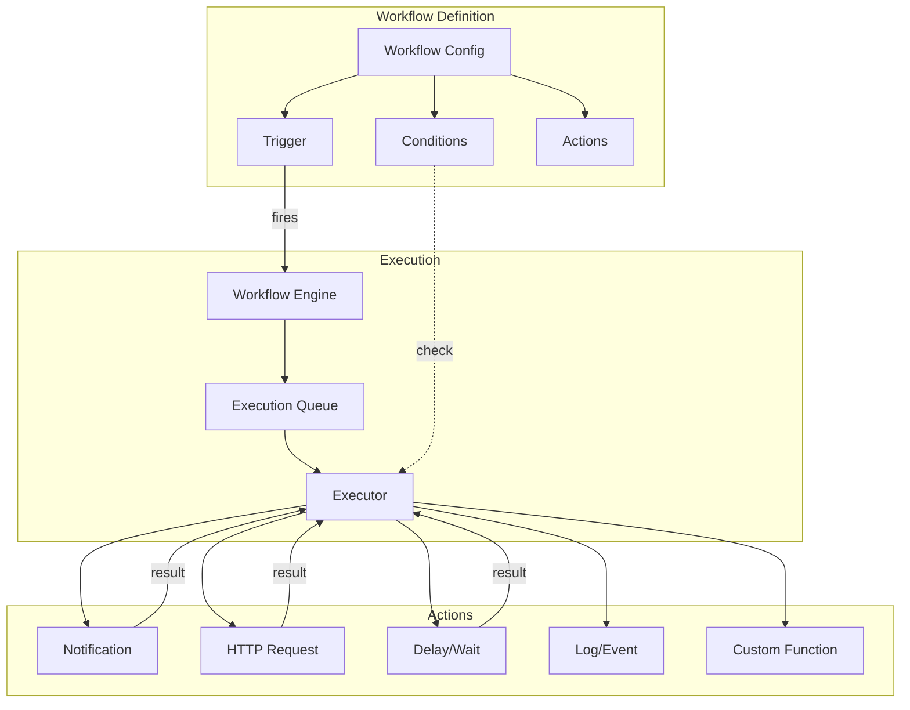

## Deployment Architecture (Development)

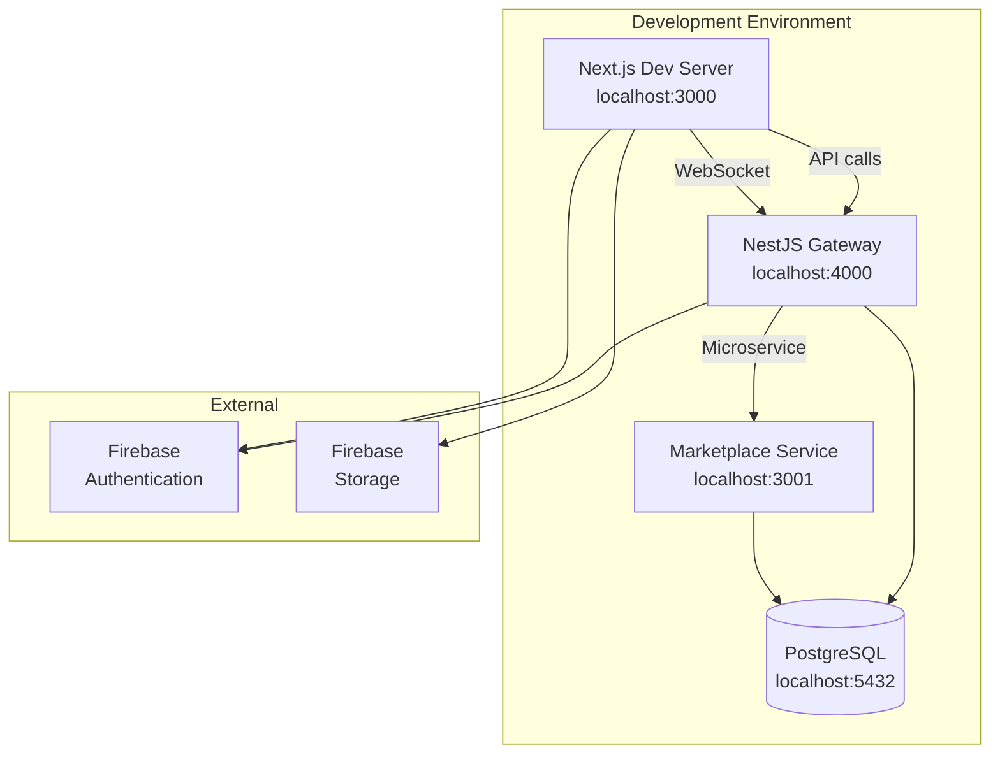

## Error Handling Flow

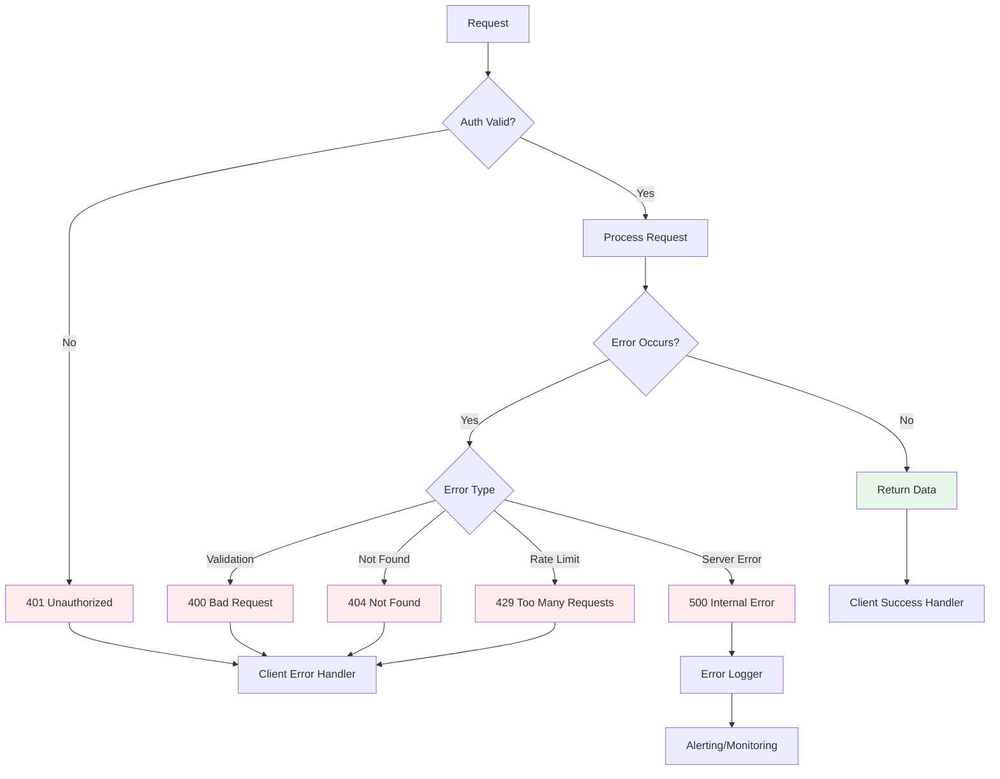

---

*Note: These diagrams use Mermaid syntax. View them in a Markdown viewer that supports Mermaid (like GitHub, GitLab, or VS Code with extensions).*
